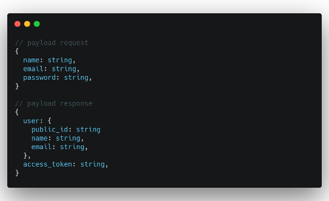
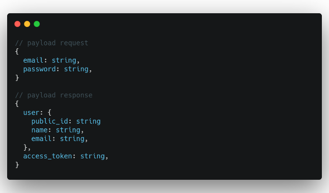
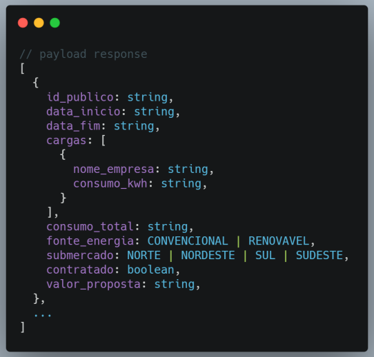
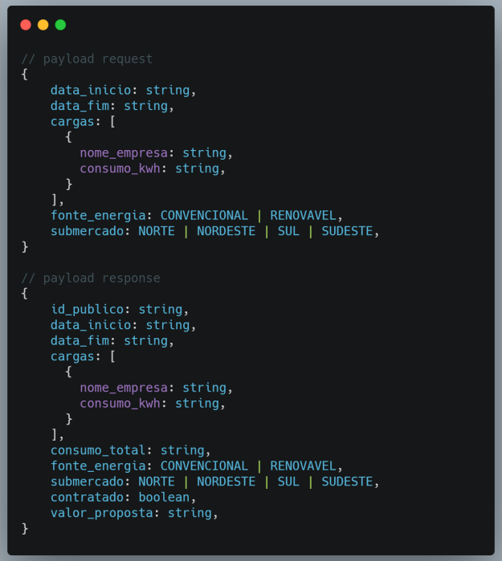
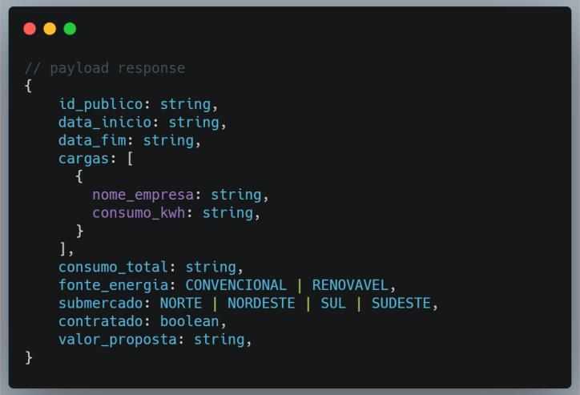
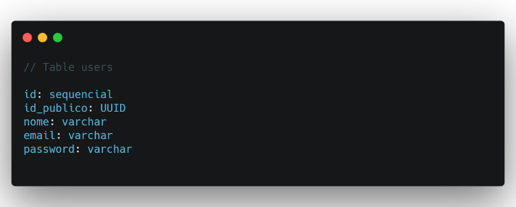
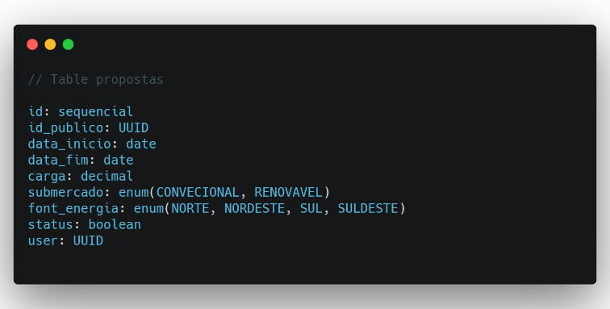

# Projeto Final - Serena

## Projeto: Calculadora de Proposta

## Desafio Gerar proposta de contrato de energia
A empresa **Serena** especializada em geração de energia renovável solicita o
desenvolvimento de uma solução para geração de propostas para contratos. Todas as
funcionalidades deverão ser desenvolvidas em uma arquitetura de webservices com arquitetura
REST para atender as demandas do site.

## Backend

### Domínio da Aplicação – Especificação de Requisitos

#### Contexto - Usuário do Sistema
O sistema deverá ter usuário logado para permitir acesso à área de propostas, funcionalidades:
**login** no sistema, sair (**logout**) e criar um usuário (**sign up**).

##### Campos para criação de um usuário:
- Nome
- E-mail
- Senha

##### Rotas:

- `[POST] /users` - Criar um usuário
  

- `[POST] /users/login` - Logar usuário
  

- `[GET] /users/:access_token/verify` - Validar token de usuário

##### Requisitos:
- **Criação de usuário**:
  - Nome: mínimo de 3 caracteres
  - E-mail: deve ser válido
  - Senha: mínimo de 8 caracteres
- **Login**:
  - E-mail válido
  - Senha com mínimo de 8 caracteres
  - Implementar funcionalidades de segurança udando Basic Auth, OAuth ou JWT (preferencialmente)

#### Contexto - Proposta
O sistema deverá poder criar, atualizar, listar e excluir propostas de contrato de energia. Uma
proposta deve ter os seguintes campos: data início, data fim, cargas contratadas (kWh), fonte
de energia, submercado, status se foi contratado e usuário dono da proposta.

##### Rotas privadas:
- `[GET] /propostas` - Listar propostas
  

- `[POST] /propostas` - Criar uma proposta
  

- `[PATCH] /propostas/:public_id` - Contratar uma proposta
  

- `[DELETE] /propostas/:public_id` - Excluir uma proposta

##### Requisitos

- **Criação de proposta**:
  - data início: obrigatório, dever ser uma data válida;
  - data fim: obrigatório, dever ser uma data válida, dever ser uma data maior que a data início;
  - Carga (s) contratada (s): obrigatório, pode ser selecionada várias cargas, deve ser
  selecionada pelo menos uma carga
  - fonte de energia: obrigatório, dever ser (CONVECIONAL, RENOVAVEL);
  - sub-mercado: obrigatório, dever ser (NORTE, NORDESTE, SUL, SULDESTE);
  - contratada: opcional, deve ser um valor booleano (Sim, Não) que diz se a proposta foi contratada ou não pelo o usuário;•
  - valor da proposta: será calculado automaticamente de acordo com os dados
  informados e com as seguintes regras:
    - O sistema assumirá que 1 kW terá o valor de 10.00 reais;
    - Cada sub-mercado terá um valor a ser acrescido: NORTE = 2.00, NORDESTE = -1.00,
  SUL = 3.50, SULDESTE = 1.50;
    - Cada fonte terá um valor a ser acrescido: CONVECIONAL = 5.00, RENOVAVEL = -2.00
  Formula para cálculo do valor da proposta: (carga * valor do kW) + sub-mercado +
  fonte.

- **Contratação de proposta**:
  - A proposta não pode ter sido contratada antes.
  - O usuário que solicitou a contratação deve ser o mesmo da proposta
    
- **Exclusão de proposta**:
  - A proposta não pode ter sido contratada.
  - O usuário que solicitou a exclusão deve ser o mesmo da proposta

- **Listagem de propostas**:
  - O usuário só pode visualizar as propostas criadas por ele mesmo.
  - As propostas devem ser listadas por ordem decrescente de criação.

## Sugestão de Modelagem de Banco
Segue uma possível modelagem dos dados, mas fique à vontade para fazer a sua.

## Frontend

### Domínio da Aplicação – Especificação de Requisitos

#### Contexto - Proposta

- O formulário deve ser inicializado com todos os valores vazios por padrão e após a
criação de uma nova proposta deve ser limpo;
- Deve ser apresentado em tempo real o valor da proposta durante o preenchimento do
formulário da calculadora de proposta;
- Na listagem das propostas deve mostrar as opções para contratar e excluir a proposta
caso ela não esteja contratada;
- Na listagem das propostas não deve mostrar as opções contratar e excluir caso a
proposta esteja contratada;

## Alguns pontos sobre segurança da aplicação:
O uso do `id_publico` é uma forma de garantir a segurança do acesso aos dados, não é
recomendado expor Ids sequenciais na API.

## Critérios de Aceite
Disponibilizar o link do github do projeto bem descrito quanto às funcionalidades,
implementações relevantes, participação dos membros da equipe, README com a jornada do
projeto final com API Rest utilizando NestJs e documentada pelo Swagger e Front utilizando
NextJs ou CRA, Interativo disponível em um ambiente Azure, Heroku, AWS, netlify ou vercel.

### Backend
- Apresentar a estrutura do projeto no github;
- Apresentar a API do projeto devidamente documentada e preferencialmente no
Heroku;
- Realizar login, cadastro de usuário.
- Demonstração de criação de proposta, contratar uma proposta, lista propostas e
excluir uma proposta.

### Requisitos Técnicos
Implementação aplicando as boas práticas de programação, uso de ORM, Framework de
persistência preferencial TypeOrm, segurança na API, integridade do banco de dados
preferencial Postgress.
